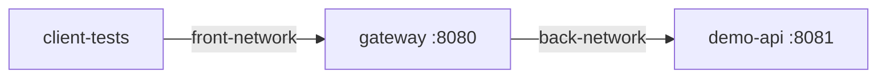

# ModuShield

ModuShield es un prototipo académico de API Gateway de seguridad construido
con Java 17, Spring Boot y Spring Cloud Gateway. El gateway es el único punto
público: identifica cada solicitud, aplica políticas de seguridad, devuelve
errores uniformes y reenvía únicamente el tráfico permitido a una API interna.

Este README contiene el recorrido completo para instalar, configurar, ejecutar
y verificar el proyecto desde un repositorio recién clonado.

## Demostración de tres contenedores

Esta demostración permite comprobar el tránsito seguro de solicitudes a través
de tres contenedores persistentes: un cliente de pruebas, ModuShield como único
gateway público y una API interna que representa al servidor protegido.



`client-tests` no pertenece a `back-network` y `demo-api` no pertenece a
`front-network`; por ello, el cliente solamente puede llegar al servidor a
través del gateway. Una imagen de contenedor comparte el kernel del host y
empaqueta la aplicación con sus dependencias. Una máquina virtual, en cambio,
ejecuta un sistema operativo invitado completo y normalmente consume más
recursos.

Para la presentación en Windows solamente se requieren Docker Desktop en
ejecución y PowerShell. Crea la configuración local a partir de la plantilla:

```powershell
Copy-Item .env.example .env
```

Completa en `.env` las variables indicadas por `.env.example`, especialmente
`MODUSHIELD_API_KEY`, `JWT_SECRET`, `ADMIN_USERNAME` y `ADMIN_PASSWORD`. La
plantilla contiene únicamente valores de ejemplo: nunca subas `.env` al
repositorio ni compartas sus valores.

Desde PowerShell, inicia y prueba toda la demostración con un único comando:

```powershell
.\run-demo.cmd
```

El resultado esperado es `client-tests` en estado `Up`, y `gateway` y
`demo-api` en estado `Up (healthy)`. Solamente el gateway publica el puerto
`8080` en la máquina anfitriona.

El ensayo automático ejecutado dentro de `client-tests` verifica:

- E01: salud del gateway.
- E02: solicitud de productos permitida.
- E03 y E04: rechazo de JWT ausente o inválido.
- E05: rechazo de una ruta bloqueada.
- E06: autorización insuficiente para escritura.
- E07: aplicación del límite de solicitudes.
- E08 y E09: aceptación del límite de 8192 bytes y rechazo al superarlo.

E10–E12 pertenecen a la validación completa ejecutada desde el host: comprueban
la respuesta `502` cuando el upstream no está disponible, el aislamiento de
red y la generación de un evento `AUDIT`. Las evidencias JSON de ambas
modalidades se conservan localmente en `docs/evidence/` y están ignoradas por
Git.

Para consultar eventos recientes y detener el entorno:

```powershell
powershell.exe -NoProfile -ExecutionPolicy Bypass -File .\scripts\demo-logs.ps1
.\stop-demo.cmd
```

Solución de problemas:

- Si Docker no responde, inicia Docker Desktop y espera a que el motor termine
  de arrancar.
- Si el puerto 8080 está ocupado, detén el proceso o contenedor que lo utiliza;
  el contrato de esta demostración conserva ese puerto.
- Si faltan recursos, aumenta la memoria disponible para Docker Desktop y
  vuelve a ejecutar `run-demo.cmd`.
- Si PowerShell restringe scripts, usa los archivos `.cmd`: aplican
  `ExecutionPolicy Bypass` solamente al proceso de la demostración y no cambian
  permanentemente la configuración del equipo.

OWASP ZAP y Sonar no forman parte del entorno operativo de esta demostración.

## 1. Arquitectura y funcionalidades

ModuShield es una aplicación Maven multimódulo:

- `gateway-service`: gateway público disponible en `http://localhost:8080`.
- `demo-api`: API interna de productos y órdenes. Escucha en el puerto 8081
  dentro de la red privada de Docker, pero no se publica hacia el host.
- `client-tests/run_demo.py`: ejecutor E2E de los escenarios E01–E12.

Las reglas principales son:

- `/api/products/**` utiliza JWT.
- `USER` puede consultar productos mediante `GET`.
- `ADMIN` puede crear, consultar, actualizar y eliminar productos.
- La ruta heredada `POST /api/orders` utiliza `X-API-Key`.
- Todas las respuestas del gateway incluyen
  `X-Content-Type-Options: nosniff` mediante un filtro global.
- Las contraseñas se almacenan como hashes BCrypt.
- Los usuarios registrados y los productos viven en memoria. Reiniciar el
  contenedor correspondiente restablece esos datos.
- Solamente el gateway está expuesto al host.

El recorrido completo es:

```text
Clonar -> configurar -> iniciar -> autenticar -> autorizar -> pruebas unitarias
       -> cobertura -> empaquetar -> Docker -> E01-E12 -> evidencia
       -> limpieza -> verificación de GitHub Actions
```

## 2. Prerrequisitos

| Herramienta | Uso | Verificación |
|---|---|---|
| Git | Clonar e identificar la revisión | `git --version` |
| JDK 17 | Compilar y ejecutar JUnit 5/JaCoCo | `java -version` |
| Docker con Compose | Construir y ejecutar la topología | `docker version` y `docker compose version` |
| Python 3 | Ejecutar `client-tests/run_demo.py` | `python3 --version` |
| curl | Pruebas HTTP manuales | `curl --version` |
| OpenSSL | Generar credenciales aleatorias | `openssl version` |

Utiliza JDK 17, por ejemplo Eclipse Temurin 17. GitHub Actions también utiliza
Temurin 17. Aunque Maven compila con objetivo Java 17, otra versión puede
cambiar el comportamiento de las pruebas. Algunas instalaciones de Java 21
impiden que Mockito/Byte Buddy adjunte su agente.

```bash
java -version
./mvnw -version
```

Ambos comandos deben indicar Java 17. En macOS, si tienes varias versiones:

```bash
export JAVA_HOME=$(/usr/libexec/java_home -v 17)
export PATH="$JAVA_HOME/bin:$PATH"
```

En Windows 11 instala Docker Desktop y Python 3 marcando la opción para agregar
Python a `PATH`. Puedes seguir los comandos Bash con Git Bash o WSL. Si
prefieres PowerShell, utiliza los equivalentes nativos incluidos más adelante;
no dependas del alias `curl` de Windows PowerShell, porque no siempre se
comporta como `curl` real. Para Maven utiliza `mvnw.cmd`.

Verifica que Docker esté iniciado:

```bash
docker info
```

No necesitas instalar Maven globalmente: el repositorio incluye Maven Wrapper.

## 3. Clonar el repositorio

```bash
git clone https://github.com/EvenWorseGroup/Modusheld.git
cd Modusheld
git switch main
git pull --ff-only
git status --short --branch
git rev-parse --short HEAD
```

`git status` no debe mostrar modificaciones locales inesperadas.

## 4. Configurar `.env` y el administrador

Crea el archivo local desde la plantilla versionada:

```bash
cp .env.example .env
```

En PowerShell:

```powershell
Copy-Item .env.example .env
```

En macOS, Linux, Git Bash o WSL, genera valores privados localmente:

```bash
openssl rand -hex 32   # MODUSHIELD_API_KEY
openssl rand -hex 48   # JWT_SECRET
openssl rand -hex 24   # ADMIN_PASSWORD
```

En Windows 11 con PowerShell, genera la misma clase de valores con el generador
criptográfico del sistema, sin instalar OpenSSL:

```powershell
function New-HexSecret([int]$Bytes) {
    $buffer = New-Object byte[] $Bytes
    $rng = [System.Security.Cryptography.RandomNumberGenerator]::Create()
    try { $rng.GetBytes($buffer) } finally { $rng.Dispose() }
    return -join ($buffer | ForEach-Object { $_.ToString("x2") })
}

New-HexSecret 32  # MODUSHIELD_API_KEY
New-HexSecret 48  # JWT_SECRET
New-HexSecret 24  # ADMIN_PASSWORD
```

Edita `.env` y sustituye todos los placeholders:

```dotenv
MODUSHIELD_API_KEY=<salida aleatoria de openssl rand -hex 32>
JWT_SECRET=<salida aleatoria de openssl rand -hex 48>
JWT_EXPIRATION_SECONDS=3600
ADMIN_USERNAME=<nombre del administrador>
ADMIN_PASSWORD=<salida aleatoria de openssl rand -hex 24>
DEMO_API_URL=http://demo-api:8081
MAX_REQUEST_SIZE_BYTES=8192
RATE_LIMIT_CAPACITY=5
RATE_LIMIT_WINDOW_SECONDS=10
SERVER_PORT=8080
```

Reglas validadas por la aplicación:

- `JWT_SECRET` debe contener al menos 32 bytes.
- `ADMIN_USERNAME` debe tener entre 3 y 64 caracteres y solamente puede
  contener letras, números, `.`, `_` o `-`.
- `ADMIN_PASSWORD` debe tener entre 8 y 128 caracteres.
- Los valores numéricos deben ser positivos.
- La API key, secreto JWT y credenciales ADMIN no pueden estar vacíos.

El administrador se crea en memoria cada vez que inicia el gateway. El endpoint
de registro solamente crea usuarios `USER`.

Comprueba que Git ignora el archivo secreto:

```bash
git status --short --ignored .env
git check-ignore -v .env
```

Nunca subas `.env` ni incluyas sus valores en capturas, issues, comentarios o
archivos del workflow.

Si un secreto se publica accidentalmente en un chat, captura o commit, trátalo
como comprometido aunque después se borre: genera otro valor, actualiza `.env`
y recrea el gateway. Un secreto JWT nuevo invalida todos los tokens anteriores.

## 5. Iniciar la aplicación con Docker Compose

```bash
docker compose -f infra/docker-compose.yml --env-file .env up -d --build
docker compose -f infra/docker-compose.yml --env-file .env ps
```

El resultado esperado es:

- `gateway` está activo y publica el puerto 8080.
- `demo-api` está activo, pero no publica un puerto del host.

Si el arranque falla:

```bash
docker compose -f infra/docker-compose.yml --env-file .env logs --no-color
```

## 6. Verificar salud y aislamiento

```bash
curl -i http://localhost:8080/health
```

Resultado esperado: HTTP `200`, `"status":"UP"` y el encabezado:

```http
X-Content-Type-Options: nosniff
```

Comprueba que el backend no está expuesto:

```bash
curl --fail --show-error --max-time 3 http://localhost:8081/health
```

Este comando debe fallar. Si el puerto 8081 responde desde el host, el
aislamiento de red se ha roto.

## 7. Registrar un usuario `USER`

Genera una contraseña de demostración en vez de reutilizar una personal:

```bash
export DEMO_USERNAME="demo-user"
export USER_PASSWORD="$(openssl rand -hex 16)"
```

```bash
curl -i -X POST http://localhost:8080/auth/register \
  -H 'Content-Type: application/json' \
  -d "{\"username\":\"${DEMO_USERNAME}\",\"password\":\"${USER_PASSWORD}\"}"
```

Resultado esperado: HTTP `201`:

```json
{"username":"demo-user","role":"USER"}
```

Registrar el mismo nombre otra vez devuelve `409 USERNAME_EXISTS`. Datos
inválidos devuelven `400 INVALID_REGISTRATION`. Si reinicias el gateway, debes
registrar nuevamente los usuarios porque viven en memoria.

## 8. Login de `USER` y obtención del JWT

Guarda la respuesta y extrae el token sin imprimirlo:

```bash
USER_LOGIN_RESPONSE="$(curl --fail --silent --show-error \
  -X POST http://localhost:8080/auth/login \
  -H 'Content-Type: application/json' \
  -d "{\"username\":\"${DEMO_USERNAME}\",\"password\":\"${USER_PASSWORD}\"}")"

export USER_TOKEN="$(printf '%s' "$USER_LOGIN_RESPONSE" | \
  python3 -c 'import json,sys; print(json.load(sys.stdin)["token"])')"
```

La respuesta contiene `token`, `tokenType`, `username`, `role` y `expiresAt`.
No imprimas ni captures el token completo.

Para inspeccionar el payload localmente:

```bash
python3 -c 'import os,json,base64; p=os.environ["USER_TOKEN"].split(".")[1]; print(json.dumps(json.loads(base64.urlsafe_b64decode(p + "=" * (-len(p) % 4))), indent=2))'
```

Debe contener `sub`, `role`, `iat` y `exp`. Decodificar el payload no valida la
firma; el gateway sí valida firma y expiración.

## 9. Probar autorización de `USER`

### Consultar productos

```bash
curl -i http://localhost:8080/api/products \
  -H "Authorization: Bearer ${USER_TOKEN}"

curl -i http://localhost:8080/api/products/P-100 \
  -H "Authorization: Bearer ${USER_TOKEN}"
```

Ambas solicitudes deben devolver HTTP `200`.

### Intentar una escritura administrativa

```bash
curl -i -X POST http://localhost:8080/api/products \
  -H "Authorization: Bearer ${USER_TOKEN}" \
  -H 'Content-Type: application/json' \
  -d '{"id":"P-USER-DENIED","name":"Denied","stock":1}'
```

Resultado esperado: HTTP `403 INSUFFICIENT_PERMISSIONS`. La restricción también
se aplica a `PUT` y `DELETE`.

## 10. Probar fallos de autenticación y seguridad

### JWT ausente

```bash
curl -i http://localhost:8080/api/products
```

Resultado esperado: HTTP `401 INVALID_TOKEN`.

### JWT inválido o alterado

```bash
curl -i http://localhost:8080/api/products \
  -H 'Authorization: Bearer definitely-wrong'
```

Resultado esperado: HTTP `401 INVALID_TOKEN`.

### Contraseña incorrecta

```bash
curl -i -X POST http://localhost:8080/auth/login \
  -H 'Content-Type: application/json' \
  -d "{\"username\":\"${DEMO_USERNAME}\",\"password\":\"wrong-password\"}"
```

Resultado esperado: HTTP `401 INVALID_CREDENTIALS`.

### JWT expirado

Cambia temporalmente `JWT_EXPIRATION_SECONDS` a `2` en `.env` y recrea el
gateway:

```bash
docker compose -f infra/docker-compose.yml --env-file .env up -d --force-recreate gateway
```

La recreación elimina los usuarios en memoria. Registra e inicia sesión otra
vez, guarda el nuevo `USER_TOKEN`, espera tres segundos y úsalo:

```bash
sleep 3
curl -i http://localhost:8080/api/products \
  -H "Authorization: Bearer ${USER_TOKEN}"
```

Debe responder `401 INVALID_TOKEN`. Después restaura
`JWT_EXPIRATION_SECONDS=3600` y recrea nuevamente el gateway.

### Ruta bloqueada

Carga las variables de `.env` en la terminal:

```bash
set -a
. ./.env
set +a
```

```bash
curl -i http://localhost:8080/api/admin/status \
  -H "X-API-Key: ${MODUSHIELD_API_KEY}"
```

Aunque la ruta existe en el backend, el gateway debe devolver
`403 ROUTE_NOT_ALLOWED`.

### Orden heredada sin API key

```bash
curl -i -X POST http://localhost:8080/api/orders \
  -H 'Content-Type: application/json' \
  -d '{"productId":"P-100","quantity":1}'
```

Resultado esperado: HTTP `401 INVALID_API_KEY`.

## 11. Login de `ADMIN`

Si todavía no cargaste `.env`:

```bash
set -a
. ./.env
set +a
```

Comprueba que las dos credenciales fueron cargadas sin mostrar sus valores:

```bash
test -n "$ADMIN_USERNAME" && echo "ADMIN_USERNAME cargado" || echo "Falta ADMIN_USERNAME"
test -n "$ADMIN_PASSWORD" && echo "ADMIN_PASSWORD cargado" || echo "Falta ADMIN_PASSWORD"
```

Si falta alguna, no continúes hasta corregir o volver a cargar `.env`. El
gateway utiliza los valores que existían cuando se creó el contenedor. Si
modificaste las credenciales en `.env` después de iniciarlo, recréalo antes del
login:

```bash
docker compose -f infra/docker-compose.yml --env-file .env up -d --force-recreate gateway
```

Obtén el JWT administrativo:

```bash
ADMIN_LOGIN_RESPONSE="$(curl --fail --silent --show-error \
  -X POST http://localhost:8080/auth/login \
  -H 'Content-Type: application/json' \
  -d "{\"username\":\"${ADMIN_USERNAME}\",\"password\":\"${ADMIN_PASSWORD}\"}")"

export ADMIN_TOKEN="$(printf '%s' "$ADMIN_LOGIN_RESPONSE" | \
  python3 -c 'import json,sys; print(json.load(sys.stdin)["token"])')"
```

La respuesta debe indicar `"role":"ADMIN"`. Confirma que se obtuvo un token
sin imprimirlo:

```bash
test -n "$ADMIN_TOKEN" && echo "ADMIN_TOKEN obtenido" || echo "Falta ADMIN_TOKEN"
```

Si el primer comando `curl` muestra el error 22/HTTP 401, el login falló y no
se debe intentar el CRUD: revisa que las variables estén cargadas y que sean
las mismas con las que arrancó el gateway.

## 12. Demostrar CRUD completo de `ADMIN`

### Crear

```bash
curl -i -X POST http://localhost:8080/api/products \
  -H "Authorization: Bearer ${ADMIN_TOKEN}" \
  -H 'Content-Type: application/json' \
  -d '{"id":"P-GUIDE","name":"Guide product","stock":3}'
```

Resultado: HTTP `201` y `Location: /api/products/P-GUIDE`.

### Consultar

```bash
curl -i http://localhost:8080/api/products/P-GUIDE \
  -H "Authorization: Bearer ${ADMIN_TOKEN}"
```

Resultado: HTTP `200`, stock `3`.

### Actualizar

```bash
curl -i -X PUT http://localhost:8080/api/products/P-GUIDE \
  -H "Authorization: Bearer ${ADMIN_TOKEN}" \
  -H 'Content-Type: application/json' \
  -d '{"id":"P-GUIDE","name":"Updated guide product","stock":9}'
```

Resultado: HTTP `200`, con nombre actualizado y stock `9`. El `id` del JSON
debe coincidir con el de la URL.

### Eliminar y confirmar

```bash
curl -i -X DELETE http://localhost:8080/api/products/P-GUIDE \
  -H "Authorization: Bearer ${ADMIN_TOKEN}"

curl -i http://localhost:8080/api/products/P-GUIDE \
  -H "Authorization: Bearer ${ADMIN_TOKEN}"
```

La eliminación devuelve HTTP `204`; la consulta posterior devuelve `404`.

El límite es cinco solicitudes por usuario dentro de diez segundos. Si recibes
HTTP `429`, espera 11 segundos antes de repetir la operación.

### Equivalentes para Windows 11 con PowerShell

Los comandos `docker compose` son iguales en PowerShell. Para las pruebas HTTP,
este recorrido evita problemas de comillas y del alias `curl`:

```powershell
$DemoUsername = "demo-user"
$DemoPassword = New-HexSecret 16
$JsonHeaders = @{ "Content-Type" = "application/json" }

$RegistrationBody = @{
    username = $DemoUsername
    password = $DemoPassword
} | ConvertTo-Json -Compress

Invoke-RestMethod -Method Post `
    -Uri "http://localhost:8080/auth/register" `
    -Headers $JsonHeaders `
    -Body $RegistrationBody

$UserLogin = Invoke-RestMethod -Method Post `
    -Uri "http://localhost:8080/auth/login" `
    -Headers $JsonHeaders `
    -Body $RegistrationBody
$UserToken = $UserLogin.token

$UserHeaders = @{ Authorization = "Bearer $UserToken" }
Invoke-RestMethod -Uri "http://localhost:8080/api/products" -Headers $UserHeaders
```

Lee únicamente las variables ADMIN requeridas desde `.env`. Esta función trata
el archivo como datos; no ejecuta sus líneas como código:

```powershell
function Get-DotEnvValue([string]$Name) {
    $prefix = "$Name="
    $line = Get-Content .env |
        Where-Object { $_.StartsWith($prefix) } |
        Select-Object -First 1
    if (-not $line) { throw "Falta $Name en .env" }
    return $line.Substring($prefix.Length)
}

$AdminUsername = Get-DotEnvValue "ADMIN_USERNAME"
$AdminPassword = Get-DotEnvValue "ADMIN_PASSWORD"
$AdminBody = @{
    username = $AdminUsername
    password = $AdminPassword
} | ConvertTo-Json -Compress

$AdminLogin = Invoke-RestMethod -Method Post `
    -Uri "http://localhost:8080/auth/login" `
    -Headers $JsonHeaders `
    -Body $AdminBody
$AdminToken = $AdminLogin.token
if ([string]::IsNullOrWhiteSpace($AdminToken)) { throw "No se obtuvo ADMIN_TOKEN" }

$AdminHeaders = @{
    Authorization = "Bearer $AdminToken"
    "Content-Type" = "application/json"
}

$Product = @{ id = "P-GUIDE"; name = "Guide product"; stock = 3 } |
    ConvertTo-Json -Compress
Invoke-RestMethod -Method Post `
    -Uri "http://localhost:8080/api/products" `
    -Headers $AdminHeaders -Body $Product

Invoke-RestMethod `
    -Uri "http://localhost:8080/api/products/P-GUIDE" `
    -Headers $AdminHeaders

$UpdatedProduct = @{ id = "P-GUIDE"; name = "Updated guide product"; stock = 9 } |
    ConvertTo-Json -Compress
Invoke-RestMethod -Method Put `
    -Uri "http://localhost:8080/api/products/P-GUIDE" `
    -Headers $AdminHeaders -Body $UpdatedProduct

Invoke-RestMethod -Method Delete `
    -Uri "http://localhost:8080/api/products/P-GUIDE" `
    -Headers $AdminHeaders
```

Para observar directamente respuestas esperadas como `401` o `403`, utiliza
`curl.exe` (con `.exe`) en PowerShell. `Invoke-RestMethod` convierte respuestas
HTTP de error en excepciones, aunque el servidor esté funcionando correctamente.

## 13. Maven, JUnit 5 y JaCoCo

El `pom.xml` padre configura JaCoCo por módulo. La fase `test` compila, ejecuta
JUnit 5, genera reportes y exige al menos 80% de cobertura de líneas de manera
independiente para `gateway-service` y `demo-api`.

Ejecuta el mismo quality gate utilizado por CI:

```bash
./mvnw --batch-mode --no-transfer-progress clean test
```

PowerShell:

```powershell
.\mvnw.cmd --batch-mode --no-transfer-progress clean test
```

El reactor debe terminar con `BUILD SUCCESS`. Un módulo debajo de `0.80` hace
fallar Maven aunque todas sus pruebas pasen.

Resultados JUnit:

```text
gateway-service/target/surefire-reports/
demo-api/target/surefire-reports/
```

Reportes JaCoCo:

```text
gateway-service/target/site/jacoco/index.html
gateway-service/target/site/jacoco/jacoco.csv
gateway-service/target/site/jacoco/jacoco.xml
demo-api/target/site/jacoco/index.html
demo-api/target/site/jacoco/jacoco.csv
demo-api/target/site/jacoco/jacoco.xml
```

Calcula los mismos porcentajes mostrados por CI:

```bash
awk -F, 'NR > 1 { missed += $8; covered += $9 } END { printf "gateway-service: %.2f%%\n", 100 * covered / (covered + missed) }' gateway-service/target/site/jacoco/jacoco.csv

awk -F, 'NR > 1 { missed += $8; covered += $9 } END { printf "demo-api: %.2f%%\n", 100 * covered / (covered + missed) }' demo-api/target/site/jacoco/jacoco.csv
```

Equivalente PowerShell:

```powershell
function Get-LineCoverage([string]$CsvPath) {
    $rows = Import-Csv $CsvPath
    $missed = ($rows | Measure-Object -Property LINE_MISSED -Sum).Sum
    $covered = ($rows | Measure-Object -Property LINE_COVERED -Sum).Sum
    return "{0:N2}%" -f (100 * $covered / ($covered + $missed))
}

"gateway-service: $(Get-LineCoverage 'gateway-service/target/site/jacoco/jacoco.csv')"
"demo-api: $(Get-LineCoverage 'demo-api/target/site/jacoco/jacoco.csv')"
```

No uses `-DskipTests` para verificar cobertura. Si Mockito no puede inicializar
Byte Buddy o adjuntar su agente, confirma que `JAVA_HOME` y `./mvnw -version`
utilicen Temurin 17. `Coverage checks have not been met` es un fallo real del
quality gate y no debe desactivarse.

Las pruebas unitarias no necesitan Docker, base de datos ni servicios externos.

## 14. Empaquetar la aplicación

Después del quality gate:

```bash
./mvnw --batch-mode --no-transfer-progress -DskipTests -Djacoco.skip=true package
```

Esto reproduce la etapa separada de empaquetado del workflow. Los JAR esperados
son:

```text
gateway-service/target/gateway-service-0.1.0-SNAPSHOT.jar
demo-api/target/demo-api-0.1.0-SNAPSHOT.jar
```

## 15. Construir las imágenes Docker

```bash
docker compose -f infra/docker-compose.yml --env-file .env build
docker compose -f infra/docker-compose.yml --env-file .env images
```

Los Dockerfiles utilizan builds multietapa con Java 17, Maven Wrapper e imágenes
de runtime que se ejecutan con usuarios sin privilegios.

## 16. Ejecutar E01–E12

Asegúrate de que ambos servicios estén activos:

```bash
docker compose -f infra/docker-compose.yml --env-file .env up -d --build
python3 client-tests/run_demo.py
```

En Windows PowerShell, si el instalador expone el launcher `py` en vez de
`python3`:

```powershell
docker compose -f infra/docker-compose.yml --env-file .env up -d --build
py -3 client-tests/run_demo.py
```

El runner lee `.env`, inicia sesión como ADMIN, crea un `USER` temporal y prueba:

| Escenario | Verificación | Resultado esperado |
|---|---|---|
| E01 | Salud del gateway | `200` |
| E02 | Login ADMIN y productos autenticados | `200` |
| E03 | Productos sin JWT | `401 INVALID_TOKEN` |
| E04 | JWT inválido | `401 INVALID_TOKEN` |
| E05 | Ruta bloqueada | `403 ROUTE_NOT_ALLOWED` |
| E06 | Escritura de `USER` | `403 INSUFFICIENT_PERMISSIONS` |
| E07 | Seis lecturas en una ventana | cinco `200` y luego `429 RATE_LIMIT_EXCEEDED` |
| E08 | Payload de exactamente 8192 bytes | `201` |
| E09 | Payload de 8193 bytes | `413 PAYLOAD_TOO_LARGE` |
| E10 | Backend detenido | `502 UPSTREAM_UNAVAILABLE` y reinicio |
| E11 | Aislamiento de red | 8081 inaccesible desde host y red frontal |
| E12 | Auditoría segura | request ID presente; JWT ausente de logs |

Resultado final esperado:

```text
Summary: 12 passed, 0 failed, 0 skipped
Evidence: .../docs/evidence/e2e-<timestamp UTC>.json
```

El runner falla con código distinto de cero si un escenario no pasa. Durante
E10 detiene y reinicia `demo-api`; en E11 crea un contenedor desechable; en E12
inspecciona logs. No lo interrumpas.

El modo parcial no disruptivo ejecuta E01–E09 y omite E10–E12:

```bash
python3 client-tests/run_demo.py --http-only
```

Este modo no demuestra que los doce escenarios pasaron.

## 17. Inspeccionar evidencia y auditoría

```bash
ls -lt docs/evidence/
python3 -m json.tool "$(ls -t docs/evidence/e2e-*.json | head -1)"
```

El JSON contiene timestamp UTC, URL, revisión Git y resultado de cada escenario,
pero no JWT, API key ni contraseñas. Una revisión terminada en `-dirty` indica
que había archivos sin confirmar.

Revisa la auditoría:

```bash
docker compose -f infra/docker-compose.yml --env-file .env logs --no-color gateway
```

Los eventos deben contener request ID y decisión, nunca el JWT o la API key
completos. `docs/evidence/*.json` está ignorado localmente; GitHub Actions lo
preserva como artefacto.

### Consultar el análisis OWASP ZAP

La evidencia versionada está en
[`entrega-final-equipo-modushield/reportes/seguridad-zap/`](entrega-final-equipo-modushield/reportes/seguridad-zap/README.md).
Contiene un análisis pasivo comparativo ejecutado con OWASP ZAP 2.17.0 sobre
`GET /health`:

- análisis inicial: una alerta baja y de confianza media por ausencia de
  `X-Content-Type-Options`;
- corrección: incorporación del filtro global `SecurityHeadersWebFilter`;
- análisis final: cero alertas dentro de los parámetros y el alcance
  seleccionados.

Los dos PDF originales y el README técnico se incluyen como evidencia. Este
resultado no equivale a un pentest completo: el ejercicio fue pasivo, se limitó
a `/health` y no cubrió rutas JWT, API key, inyección, lógica de negocio ni
disponibilidad. La ampliación del alcance y su automatización en CI permanecen
como acciones futuras.

## 18. Limpiar el entorno

```bash
docker compose -f infra/docker-compose.yml --env-file .env down --volumes --remove-orphans
docker compose -f infra/docker-compose.yml --env-file .env ps
```

El segundo comando no debe mostrar contenedores activos del proyecto.

Elimina secretos de la terminal:

```bash
unset DEMO_USERNAME USER_PASSWORD USER_LOGIN_RESPONSE USER_TOKEN
unset ADMIN_LOGIN_RESPONSE ADMIN_TOKEN
unset MODUSHIELD_API_KEY JWT_SECRET ADMIN_USERNAME ADMIN_PASSWORD
```

En PowerShell, elimina las variables y tokens de la sesión:

```powershell
Remove-Variable DemoUsername, DemoPassword, UserLogin, UserToken -ErrorAction SilentlyContinue
Remove-Variable AdminUsername, AdminPassword, AdminLogin, AdminToken -ErrorAction SilentlyContinue
```

Conserva `.env` solamente en un equipo confiable. Puede recrearse desde
`.env.example`. Los directorios `target/` y la evidencia local están ignorados.

## 19. Pipeline de GitHub Actions

El workflow `.github/workflows/ci.yml`, llamado **CI and test deployment**, se
ejecuta en cada pull request, en cada push a `main` y manualmente mediante
`workflow_dispatch`.

Utiliza un runner Ubuntu hospedado por GitHub como entorno aislado y efímero.
Las etapas son:

1. Checkout.
2. Temurin Java 17 y caché Maven.
3. JUnit 5 y JaCoCo ≥80% por módulo.
4. Publicación de porcentajes en el resumen.
5. Empaquetado Maven.
6. Carga de reportes JaCoCo.
7. Generación de credenciales aleatorias para esa ejecución.
8. Construcción de imágenes Docker.
9. Despliegue con el Compose existente.
10. Espera de `/health` hasta 60 segundos.
11. Ejecución obligatoria de E01–E12.
12. Registro del despliegue exitoso.
13. Carga de evidencia y logs de fallo.
14. `docker compose down` incluso si una prueba posterior al despliegue falla.

El job es secuencial: empaquetado, Docker, despliegue y E2E no se ejecutan si
falla JUnit o el gate JaCoCo. El endpoint localhost solo existe durante la
ejecución y desaparece al terminar.

## 20. Ejecutar y verificar GitHub Actions

### Mediante pull request

1. Crea una rama y confirma solamente los cambios deseados.
2. Sube la rama y abre un pull request.
3. Abre **Actions -> CI and test deployment**.
4. Selecciona la ejecución del pull request.
5. Confirma que **Test, build, and deploy isolated environment** termine verde.
6. Después de integrar, verifica también la ejecución generada por el push a
   `main`.

### Ejecución manual en `main`

1. Abre **Actions** en GitHub.
2. Selecciona **CI and test deployment**.
3. Presiona **Run workflow**.
4. Elige `main`, confirma y espera la finalización.

Si el botón no aparece, comprueba que Actions esté habilitado en
**Settings -> Actions -> General** y que el workflow con `workflow_dispatch`
exista en la rama.

### Evidencia de éxito

Verifica que:

- JUnit 5 y el gate JaCoCo terminaron correctamente.
- El resumen muestra ≥80% en ambos módulos.
- El empaquetado y las imágenes Docker se construyeron.
- El entorno Compose inició y `/health` respondió.
- E01–E12 reportó doce escenarios aprobados.
- **Tear down isolated environment** se ejecutó.

Descarga desde **Artifacts**:

- `jacoco-reports-<run id>`: HTML, CSV y XML de ambos módulos.
- `e2e-evidence-<run id>`: JSON E01–E12 y logs cuando corresponda.

La retención depende de la configuración del repositorio u organización.
Descarga la evidencia de evaluación antes de que expire.

## Documentación de la demostración

- [Guía de demostración](docs/demo/GUIA_DEMOSTRACION.md)
- [Arquitectura de la demostración](docs/demo/ARQUITECTURA_DEMO.md)
- [Plan de contingencia](docs/demo/PLAN_CONTINGENCIA.md)
- [Hoja rápida de exposición](docs/demo/HOJA_RAPIDA.md)

## Documentación adicional

- [Arquitectura](docs/architecture.md)
- [Políticas](docs/policies.md)
- [Estado de integración](docs/integration.md)
- [Contratos para la presentación](docs/presentation-contracts.md)
- [Guion de demostración](docs/demo-script.md)
- [Infraestructura](infra/README.md)
- [Análisis comparativo OWASP ZAP](entrega-final-equipo-modushield/reportes/seguridad-zap/README.md)
