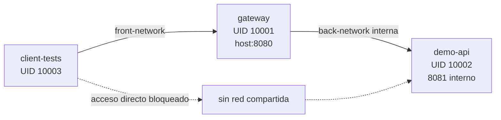

# Arquitectura de la demostración

## Vista general

`client-tests` pertenece únicamente a `front-network`; `demo-api`, únicamente
a `back-network`. El gateway es el único servicio presente en ambas redes y el
único que publica un puerto al host: `8080`. El puerto `8081` de Demo API se
expone solo dentro de Docker.

## Conceptos sencillos

Un **proxy inverso** recibe solicitudes en nombre de uno o más servidores y
reenvía solamente las que corresponden. Un **API Gateway** añade decisiones
específicas para APIs: autenticación, autorización, políticas de ruta, límites,
errores uniformes y auditoría. En ModuShield, el cliente no conoce una ruta de
red directa hacia Demo API; debe pasar por el gateway.

## Responsabilidades

| Servicio | Responsabilidad | Red | Puerto | Usuario |
|---|---|---|---|---:|
| `client-tests` | Ejecutar E01–E09 y guardar evidencia | `front-network` | Ninguno publicado | 10003 |
| `gateway` | Aplicar políticas, registrar auditoría y reenviar tráfico permitido | `front-network`, `back-network` | `8080:8080` | 10001 |
| `demo-api` | Servir productos y órdenes detrás del gateway | `back-network` | `8081` interno | 10002 |

## Flujo de una petición

1. `client-tests` envía HTTP a `http://gateway:8080`.
2. El gateway asigna o conserva un identificador de solicitud.
3. Evalúa ruta, credenciales, permisos, tamaño y rate limiting.
4. Si la petición está permitida, la reenvía a `http://demo-api:8081`.
5. Si está bloqueada o el upstream falla, genera el contrato de error previsto.
6. Registra un evento de auditoría sanitizado.

El intento `client-tests` → `demo-api:8081` falla porque no comparten red. El
intento desde el host también falla porque `8081` no está publicado.

## Controles demostrados

| Control | Evidencia observable |
|---|---|
| Autenticación | JWT ausente o inválido → `401 INVALID_TOKEN` |
| Autorización | Escritura de `USER` → `403 INSUFFICIENT_PERMISSIONS` |
| Rutas | Ruta no permitida → `403 ROUTE_NOT_ALLOWED` |
| Tamaño de payload | 8192 bytes aceptados; 8193 → `413 PAYLOAD_TOO_LARGE` |
| Rate limiting | Cinco solicitudes permitidas; sexta → `429 RATE_LIMIT_EXCEEDED` |
| Cabeceras | Respuestas del gateway incluyen `X-Content-Type-Options: nosniff` |
| Errores | Upstream no disponible → `502 UPSTREAM_UNAVAILABLE` |
| Auditoría | `requestId`, decisión, regla, estado y duración; sin JWT en logs |

Los healthchecks de gateway y Demo API determinan el orden de arranque. El
cliente comienza solamente después de que el gateway está saludable, y el
gateway espera a que Demo API esté saludable.

